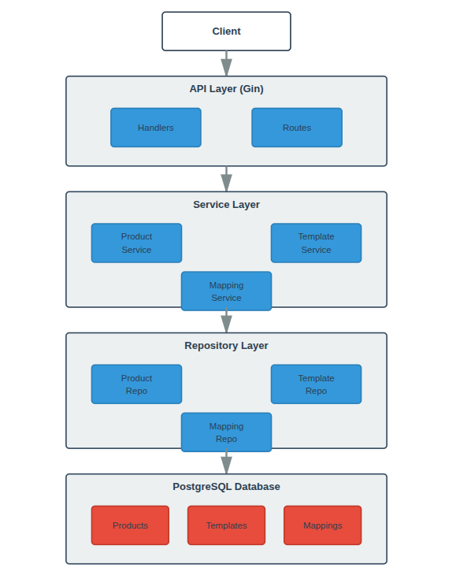
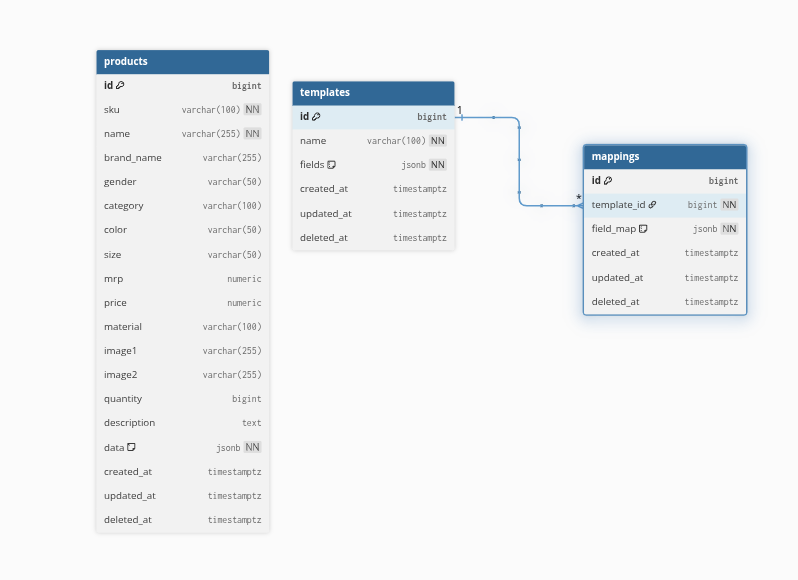

# Product Template Mapping System

A robust Go-based API system for managing products with dynamic template mappings. This system allows you to define templates (like Amazon, Flipkart formats), map product fields to template fields, and transform product data according to different marketplace requirements.

## Table of Contents

- [System Design](#system-design)
- [Database Schema](#database-schema)
- [API Documentation](#api-documentation)
- [Setup Instructions](#setup-instructions)
- [Running with Docker](#running-with-docker)
- [Running Tests](#running-tests)
- [Usage Examples](#usage-examples)

---

## System Design

### Architecture Overview



### Key Components

1. **Products**: Store product information with flexible schema
2. **Templates**: Define output formats for different marketplaces
3. **Mappings**: Define field transformations from products to templates
4. **Transformation Engine**: Converts product data according to template mappings

### Data Flow
```
CSV Upload → Parse → Validate → Map → Store → Transform → Output
```

---
## Database Schema




### Relationship Details

- **Templates ↔ Mappings**: One-to-Many (1:N)
  - One template (e.g., "Flipkart Template") can have multiple mappings
  - Each mapping references one template via `template_id` foreign key
  - Cascade delete: When a template is deleted, all its mappings are deleted
  
- **Products**: Independent table
  - No direct foreign key relationship with templates or mappings
  - Products are transformed at runtime based on selected mapping

### Example Data Structure
```sql
-- One Template
INSERT INTO templates (id, name, fields) VALUES 
(1, 'Flipkart Template', '["productName", "brand", "price", "sku"]');

-- Multiple Mappings for the same template
INSERT INTO mappings (template_id, field_map) VALUES 
(1, '{"productName": "name", "brand": "brand_name", "price": "price", "sku": "sku"}'),
(1, '{"productName": "name", "brand": "brand_name", "price": "mrp", "sku": "sku"}'),
(1, '{"productName": "name", "brand": "brand_name", "price": "price", "sku": "sku"}');
```
## API Documentation

### Base URL
```
http://localhost:8082/api/v1
```

### Endpoints

#### 1. Products

##### Get All Products
```http
GET /api/v1/products/
```

**Response:**
```json
{
  "success": true,
  "data": [
    {
      "id": 1,
      "sku": "IPHONE-15-PRO-001",
      "name": "iPhone 15 Pro",
      "brandName": "Apple",
      "gender": "Unisex",
      "category": "Electronics",
      "color": "Natural Titanium",
      "size": "256GB",
      "mrp": 1199.99,
      "price": 999.99,
      "material": "Titanium",
      "image1": "https://example.com/iphone15pro-1.jpg",
      "image2": "https://example.com/iphone15pro-2.jpg",
      "quantity": 50,
      "description": "Latest iPhone with A17 Pro chip and titanium design",
      "data": {},
      "createdAt": "2024-01-12T10:00:00Z",
      "updatedAt": "2024-01-12T10:00:00Z"
    }
  ],
  "statusCode": 200
}
```

##### Get Products by Mapping (Transformed)
```http
GET /api/v1/products?mappingId=:id
```

**Example:**
```http
GET /api/v1/products?mappingId=5
```

**Response (Products transformed according to the mapping's template):**
```json
{
  "success": true,
  "data": [
    {
      "id": 1,
      "productName": "iPhone 15 Pro",
      "brand": "Apple",
      "gender": "Unisex",
      "category": "Electronics",
      "color": "Natural Titanium",
      "size": "256GB",
      "mrp": 1199.99,
      "price": 999.99,
      "sku": "IPHONE-15-PRO-001",
      "description": "Latest iPhone with A17 Pro chip and titanium design",
      "material": "Titanium",
      "images": "https://example.com/iphone15pro-1.jpg"
    }
  ],
  "statusCode": 200
}
```

##### Upload Products (CSV)
```http
POST /api/v1/products/upload?sellerName=test
Content-Type: multipart/form-data
```

**Request:**
```
file: product_data.csv (form-data)
```

**Sample CSV Format:**
```csv
sku,name,brand_name,gender,category,color,size,mrp,price,material,image1,image2,quantity,description
IPHONE-15-PRO-001,iPhone 15 Pro,Apple,Unisex,Electronics,Natural Titanium,256GB,1199.99,999.99,Titanium,https://example.com/iphone15pro-1.jpg,https://example.com/iphone15pro-2.jpg,50,Latest iPhone with A17 Pro chip and titanium design. Features advanced camera system and action button.
SAMSUNG-S24-001,Samsung Galaxy S24,Samsung,Unisex,Electronics,Phantom Black,128GB,999.99,899.99,Glass & Aluminum,https://example.com/galaxys24-1.jpg,https://example.com/galaxys24-2.jpg,75,Galaxy AI-powered smartphone with Snapdragon 8 Gen 3 processor and advanced camera features.
SONY-WH1000XM5-001,Sony WH-1000XM5,Sony,Unisex,Audio,Black,One Size,399.99,349.99,Plastic & Leather,https://example.com/sonywh1000xm5-1.jpg,https://example.com/sonywh1000xm5-2.jpg,120,Industry-leading noise canceling headphones with 30-hour battery life and premium sound quality.
MACBOOK-PRO-16-001,MacBook Pro 16,Apple,Unisex,Computers,Space Black,M3 Pro,2999.99,2499.99,Aluminum,https://example.com/macbookpro16-1.jpg,https://example.com/macbookpro16-2.jpg,30,16-inch MacBook Pro with M3 Pro chip. Perfect for professional creative work and development.
NIKE-AIR-MAX-001,Nike Air Max 90,Nike,Men,Footwear,White/Black,US 10,149.99,129.99,Leather & Mesh,https://example.com/nikeairmax-1.jpg,https://example.com/nikeairmax-2.jpg,200,Classic Nike Air Max 90 sneakers with iconic design and comfortable Air cushioning technology.
ADIDAS-ULTRA-001,Adidas Ultraboost 22,Adidas,Women,Footwear,Core Black,US 8,189.99,169.99,Primeknit,https://example.com/ultraboost-1.jpg,https://example.com/ultraboost-2.jpg,150,Premium running shoes with responsive Boost cushioning and flexible Primeknit upper.
LEVI-JEANS-001,Levi's 501 Original Jeans,Levi's,Men,Clothing,Dark Blue,32x32,79.99,69.99,Denim,https://example.com/levis501-1.jpg,https://example.com/levis501-2.jpg,300,Classic straight-fit jeans with button fly. Original since 1873. Premium denim construction.
ZARA-DRESS-001,Zara Floral Summer Dress,Zara,Women,Clothing,Floral Print,M,89.99,59.99,Cotton & Polyester,https://example.com/zaradress-1.jpg,https://example.com/zaradress-2.jpg,180,Elegant floral print summer dress with flowing silhouette. Perfect for casual and semi-formal occasions.
KINDLE-PAPER-001,Kindle Paperwhite,Amazon,Unisex,Electronics,Black,8GB,139.99,119.99,Plastic,https://example.com/kindle-1.jpg,https://example.com/kindle-2.jpg,250,Waterproof e-reader with 6.8-inch display and adjustable warm light. Store thousands of books.
DYSON-V15-001,Dyson V15 Detect,Dyson,Unisex,Home Appliances,Nickel/Iron,Standard,749.99,649.99,Plastic & Metal,https://example.com/dysonv15-1.jpg,https://example.com/dysonv15-2.jpg,45,Cordless vacuum with laser detection and intelligent cleaning. Up to 60 minutes of run time.
```

**Response:**
```json
{
  "success": true,
  "message": "Products uploaded and stored successfully",
  "data": {
    "fileName": "product_data.csv",
    "totalRows": 10,
    "successCount": 1,
    "failedCount": 9,
    "discoveredColumns": [
      "sku",
      "name",
      "brand_name",
      "gender",
      "category",
      "color",
      "size",
      "mrp",
      "price",
      "material",
      "image1",
      "image2",
      "quantity",
      "description"
    ],
    "sampleProducts": [
      {
        "id": 39,
        "sku": "ADIDAS-ULTRA-001",
        "name": "Adidas Ultraboost 22",
        "price": 169.99,
        "quantity": 150
      }
    ],
    "errors": [
      {
        "row": 2,
        "sku": "IPHONE-15-PRO-001",
        "message": "Database error: ERROR: duplicate key value violates unique constraint \"uni_products_sku\" (SQLSTATE 23505)"
      }
    ]
  },
  "statusCode": 201
}
```

**Status Codes:**
- `201`: Products created successfully
- `206`: Partial success (some products failed)
- `400`: Invalid request
- `422`: Validation error

#### 2. Templates

##### Get All Templates
```http
GET /api/v1/templates/
```

**Response:**
```json
{
  "success": true,
  "data": [
    {
      "id": 4,
      "name": "Flipkart Template 1",
      "fields": [
        "productName",
        "brand",
        "gender",
        "category",
        "color",
        "size",
        "mrp",
        "price",
        "sku",
        "description",
        "material",
        "images"
      ],
      "createdAt": "2026-01-13T04:33:17.145573385Z",
      "updatedAt": "2026-01-13T04:33:17.145573448Z"
    }
  ],
  "statusCode": 200
}
```

##### Create Template
```http
POST /api/v1/templates/
Content-Type: application/json
```

**Request Body:**
```json
{
  "name": "Flipkart Template 1",
  "fields": [
    "productName",
    "brand",
    "gender",
    "category",
    "color",
    "size",
    "mrp",
    "price",
    "sku",
    "description",
    "material",
    "images"
  ]
}
```

**Response:**
```json
{
  "success": true,
  "data": {
    "id": 4,
    "name": "Flipkart Template 1",
    "fields": [
      "productName",
      "brand",
      "gender",
      "category",
      "color",
      "size",
      "mrp",
      "price",
      "sku",
      "description",
      "material",
      "images"
    ],
    "createdAt": "2026-01-13T04:33:17.145573385Z",
    "updatedAt": "2026-01-13T04:33:17.145573448Z"
  },
  "statusCode": 200
}
```

#### 3. Mappings

##### Get All Mappings
```http
GET /api/v1/mappings/
```

**Response:**
```json
{
  "success": true,
  "data": [
    {
      "id": 5,
      "templateId": 4,
      "sellerId":1,
      "fieldMap": {
        "productName": "name",
        "brand": "brand_name",
        "gender": "gender",
        "category": "category",
        "color": "color",
        "size": "size",
        "mrp": "mrp",
        "price": "price",
        "sku": "sku",
        "description": "description",
        "material": "material",
        "images": "image1",
        "id": "id"
      },
      "createdAt": "2026-01-13T04:50:44.977717894Z",
      "updatedAt": "2026-01-13T04:50:44.977717976Z",
      "template": {
        "id": 4,
        "name": "Flipkart Template 1",
        "fields": [
          "productName",
          "brand",
          "gender",
          "category",
          "color",
          "size",
          "mrp",
          "price",
          "sku",
          "description",
          "material",
          "images"
        ]
      }
    }
  ],
  "statusCode": 200
}
```

##### Create Mapping
```http
POST /api/v1/mappings/
Content-Type: application/json
```

**Request Body:**
```json
{
  "templateId": 4,
  "sellerId":1,
  "fieldMap": {
    "productName": "name",
    "brand": "brand_name",
    "gender": "gender",
    "category": "category",
    "color": "color",
    "size": "size",
    "mrp": "mrp",
    "price": "price",
    "sku": "sku",
    "description": "description",
    "material": "material",
    "images": "image1",
    "id": "id"
  }
}
```

**Response:**
```json
{
  "success": true,
  "data": {
    "id": 5,
    "templateId": 4,
    "fieldMap": {
      "brand": "brand_name",
      "category": "category",
      "color": "color",
      "description": "description",
      "gender": "gender",
      "id": "id",
      "images": "image1",
      "material": "material",
      "mrp": "mrp",
      "price": "price",
      "productName": "name",
      "size": "size",
      "sku": "sku"
    },
    "createdAt": "2026-01-13T04:50:44.977717894Z",
    "updatedAt": "2026-01-13T04:50:44.977717976Z"
  },
  "statusCode": 200
}
```

##### Get Products by Template (Transformed)
```http
GET /api/v1/products?mappingId=:id
```

**Example:**
```http
GET /api/v1/products?mappingId=5
```

**Response (Products transformed according to Flipkart template):**
```json
{
  "success": true,
  "data": [
    {
      "id": 1,
      "productName": "iPhone 15 Pro",
      "brand": "Apple",
      "gender": "Unisex",
      "category": "Electronics",
      "color": "Natural Titanium",
      "size": "256GB",
      "mrp": 1199.99,
      "price": 999.99,
      "sku": "IPHONE-15-PRO-001",
      "description": "Latest iPhone with A17 Pro chip and titanium design",
      "material": "Titanium",
      "images": "https://example.com/iphone15pro-1.jpg"
    }
  ],
  "statusCode": 200
}
```

---

## Setup Instructions

### Prerequisites

- Go 1.21 or higher
- PostgreSQL 14 or higher
- Docker & Docker Compose (for containerized setup)


## Running with Docker

### Option 1: Docker Compose (Recommended)

#### 1. Create environment file
```bash
# Copy example environment file
cp .env.example .env
```

**Update .env for Docker:**
```env
DB_HOST=postgres
DB_PORT=5432
DB_USER=postgres
DB_PASSWORD=postgres
DB_NAME=product_db
DB_SSLMODE=disable

PORT=8082
GIN_MODE=release
APP_ENV=production
```

#### 2. Build and run with Docker Compose
```bash
# Build and start all services
docker-compose up --build

# Run in detached mode
docker-compose up -d --build

# View logs
docker-compose logs -f

# Stop services
docker-compose down

# Stop and remove volumes
docker-compose down -v
```

#### 3. Access the application
```
API: http://localhost:8082
Database: localhost:5432
```

#### Run tests with coverage
```bash
# Generate coverage report
go test ./internal/services -coverprofile=coverage.out

# View coverage in terminal
go tool cover -func=coverage.out

# Generate HTML coverage report
go tool cover -html=coverage.out -o coverage.html

# Open coverage report in browser
open coverage.html  # macOS
xdg-open coverage.html  # Linux
```

#### Run tests in Docker
```bash
# Run tests in container
docker-compose run --rm app go test ./internal/services -v

# Run with coverage
docker-compose run --rm app go test ./internal/services -cover
```

### Test Coverage Summary
```
Extraction Tests:     6 test cases
Mapping Tests:        6 test cases
Validation Tests:    11 test cases
Helper Functions:    28 test cases
Integration Tests:    1 test case
─────────────────────────────────
Total:               52 test cases
Coverage:            ~42% of statements
```

### Load Testing (Optional)
```bash
# Install Apache Bench
sudo apt-get install apache2-utils

# Test product upload endpoint
ab -n 100 -c 10 -p product_data.csv -T 'multipart/form-data' \
  http://localhost:8082/api/v1/products/upload

# Test get products endpoint
ab -n 1000 -c 50 http://localhost:8082/api/v1/products/
```

---

## Usage Examples

### Complete Workflow Example

#### Step 1: Create a Template
```bash
curl -X POST http://localhost:8082/api/v1/templates/ \
  -H "Content-Type: application/json" \
  -d '{
    "name": "Flipkart Template 1",
    "fields": [
      "productName",
      "brand",
      "gender",
      "category",
      "color",
      "size",
      "mrp",
      "price",
      "sku",
      "description",
      "material",
      "images"
    ]
  }'
```

#### Step 2: Create a Mapping
```bash
curl -X POST http://localhost:8082/api/v1/mappings/ \
  -H "Content-Type: application/json" \
  -d '{
    "templateId": 4,
    "fieldMap": {
      "productName": "name",
      "brand": "brand_name",
      "gender": "gender",
      "category": "category",
      "color": "color",
      "size": "size",
      "mrp": "mrp",
      "price": "price",
      "sku": "sku",
      "description": "description",
      "material": "material",
      "images": "image1",
      "id": "id"
    }
  }'
```

#### Step 3: Upload Products
```bash
curl -X POST "http://localhost:8082/api/v1/products/upload?sellerName=test" \
  -F "file=@product_data.csv"
```

#### Step 4: Get Transformed Products
```bash
curl -X GET http://localhost:8082/api/v1/products?mappingId=5
```

### Sample CSV File

Create `product_data.csv`:
```csv
sku,name,brand_name,gender,category,color,size,mrp,price,material,image1,image2,quantity,description
IPHONE-15-PRO-001,iPhone 15 Pro,Apple,Unisex,Electronics,Natural Titanium,256GB,1199.99,999.99,Titanium,https://example.com/iphone15pro-1.jpg,https://example.com/iphone15pro-2.jpg,50,Latest iPhone with A17 Pro chip and titanium design
SAMSUNG-S24-001,Samsung Galaxy S24,Samsung,Unisex,Electronics,Phantom Black,128GB,999.99,899.99,Glass & Aluminum,https://example.com/galaxys24-1.jpg,https://example.com/galaxys24-2.jpg,75,Galaxy AI-powered smartphone
ADIDAS-ULTRA-001,Adidas Ultraboost 22,Adidas,Women,Footwear,Core Black,US 8,189.99,169.99,Primeknit,https://example.com/ultraboost-1.jpg,https://example.com/ultraboost-2.jpg,150,Premium running shoes
```

### Postman Collection

Import the following JSON into Postman:
```json
{
  "info": {
    "name": "Product Template API",
    "schema": "https://schema.getpostman.com/json/collection/v2.1.0/collection.json"
  },
  "item": [
    {
      "name": "Products",
      "item": [
        {
          "name": "Get All Products",
          "request": {
            "method": "GET",
            "url": "{{base_url}}/products/"
          }
        },
        {
          "name": "Upload Products CSV",
          "request": {
            "method": "POST",
            "url": "{{base_url}}/products/upload",
            "body": {
              "mode": "formdata",
              "formdata": [
                {
                  "key": "file",
                  "type": "file",
                  "src": "/path/to/product_data.csv"
                }
              ]
            }
          }
        },
        {
          "name": "Get Products by Mapping",
          "request": {
            "method": "GET",
            "url": "{{base_url}}/products?mappingId=5"
          }
        }
      ]
    },
    {
      "name": "Templates",
      "item": [
        {
          "name": "Get All Templates",
          "request": {
            "method": "GET",
            "url": "{{base_url}}/templates/"
          }
        },
        {
          "name": "Create Template",
          "request": {
            "method": "POST",
            "url": "{{base_url}}/templates/",
            "header": [
              {
                "key": "Content-Type",
                "value": "application/json"
              }
            ],
            "body": {
              "mode": "raw",
              "raw": "{\n  \"name\": \"Flipkart Template 1\",\n  \"fields\": [\n    \"productName\",\n    \"brand\",\n    \"gender\",\n    \"category\",\n    \"color\",\n    \"size\",\n    \"mrp\",\n    \"price\",\n    \"sku\",\n    \"description\",\n    \"material\",\n    \"images\"\n  ]\n}"
            }
          }
        }
      ]
    },
    {
      "name": "Mappings",
      "item": [
        {
          "name": "Get All Mappings",
          "request": {
            "method": "GET",
            "url": "{{base_url}}/mappings/"
          }
        },
        {
          "name": "Create Mapping",
          "request": {
            "method": "POST",
            "url": "{{base_url}}/mappings/",
            "header": [
              {
                "key": "Content-Type",
                "value": "application/json"
              }
            ],
            "body": {
              "mode": "raw",
              "raw": "{\n  \"templateId\": 4,\n  \"productId\": 1,\n  \"fieldMap\": {\n    \"productName\": \"name\",\n    \"brand\": \"brand_name\",\n    \"gender\": \"gender\",\n    \"category\": \"category\",\n    \"color\": \"color\",\n    \"size\": \"size\",\n    \"mrp\": \"mrp\",\n    \"price\": \"price\",\n    \"sku\": \"sku\",\n    \"description\": \"description\",\n    \"material\": \"material\",\n    \"images\": \"image1\",\n    \"id\": \"id\"\n  }\n}"
          }
        },
        {
          "name": "Get Products by Mapping",
          "request": {
            "method": "GET",
            "url": "{{base_url}}/products?mappingId=5"
          }
        }
      ]
    }
  ],
  "variable": [
    {
      "key": "base_url",
      "value": "http://localhost:8082/api/v1"
    }
  ]
}
```

---

## Troubleshooting

### Common Issues

#### Database Connection Failed
```bash
# Check if PostgreSQL is running
docker ps | grep postgres

# Check logs
docker logs postgres

# Verify connection
psql -h localhost -U postgres -d product_db
```

#### Port Already in Use
```bash
# Find process using port 8082
lsof -i :8082

# Kill the process
kill -9 <PID>

# Or use different port in .env
PORT=8083
```

#### CSV Upload Fails

- Ensure CSV has headers in the first row
- Check that SKU and Name columns are present
- Verify file encoding is UTF-8
- Check file size limits

---

## Project Structure
```
.
├── cmd/
│   └── server/
│       └── main.go              # Application entry point
├── internal/
│   ├── handlers/                # HTTP handlers
│   │   ├── product/
│   │   ├── template/
│   │   └── mapping/
│   ├── services/                # Business logic
│   │   ├── product_service.go
│   │   ├── template_service.go
│   │   └── mapping_service.go
│   ├── repository/              # Data access layer
│   │   ├── product_repository.go
│   │   ├── template_repository.go
│   │   └── mapping_repository.go
│   ├── models/                  # Database models
│   │   ├── product.go
│   │   ├── template.go
│   │   └── mapping.go
│   └── requests/                # Request/Response DTOs
├── .env.example                 # Example environment file
├── docker-compose.yml           # Docker compose configuration
├── Dockerfile                   # Docker image definition
├── go.mod                       # Go dependencies
├── go.sum                       # Dependency checksums
└── README.md                    # This file
```